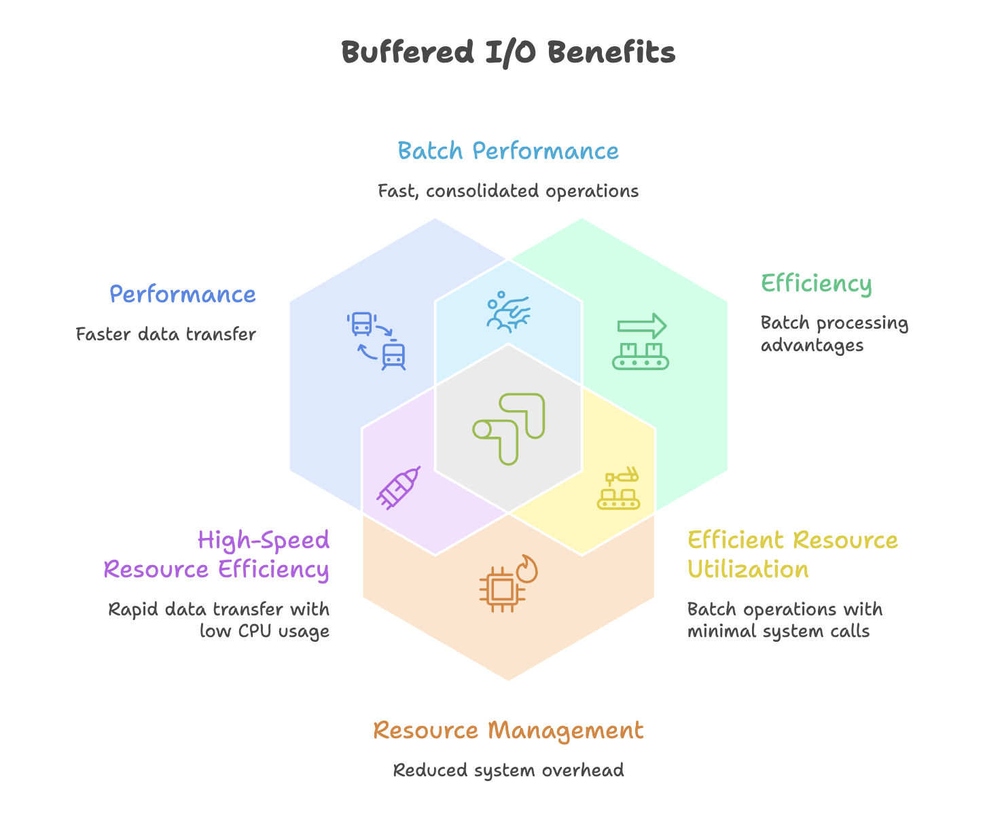
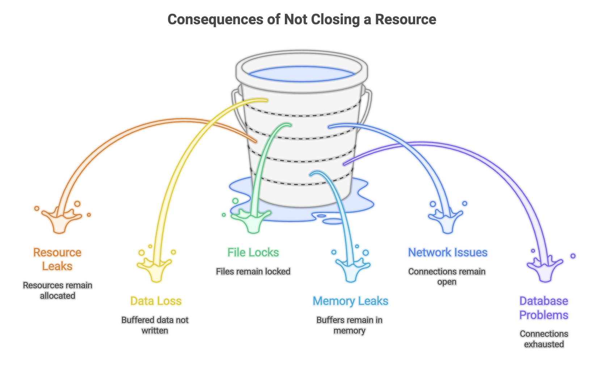

# Java Buffered I/O and User Input

Buffered I/O represents an optimization layer built on top of basic file operations in Java. While basic `FileReader` and `FileWriter` classes work directly with files, buffered I/O classes add an intermediate memory buffer that significantly improves performance by reducing the number of actual disk operations.


## What Is a Buffer?

A **buffer** is a temporary storage area in memory that holds data during I/O operations. Instead of reading or writing one character at a time directly to/from the disk, buffered I/O:

1. Reads large chunks of data into memory (buffer)
2. Provides data to your program from the buffer
3. When writing, collects data in the buffer first
4. Writes the entire buffer to disk in one operation




---


## BufferedWriter: Writing with Buffers

The `BufferedWriter` class wraps around a `Writer` (typically `FileWriter`) to provide buffered output operations.

```java
import java.io.BufferedWriter;
import java.io.FileWriter;
import java.io.IOException;

public class BufferedWriterExample {
    public static void main(String[] args) {

            // Create a FileWriter
            FileWriter fileWriter = new FileWriter("buffered_output.txt");

            // Wrap it with BufferedWriter
            BufferedWriter bufferedWriter = new BufferedWriter(fileWriter);

            // Write data to the buffer
            bufferedWriter.write("This is written using BufferedWriter.");
            bufferedWriter.newLine(); // Add a newline
            bufferedWriter.write("Buffered I/O improves performance.");
            bufferedWriter.newLine();
            bufferedWriter.write("Especially for large files.");

            // CRITICAL: Close the BufferedWriter
            bufferedWriter.close();

            System.out.println("Data written successfully with BufferedWriter.");
    }
}
```

**Key Features:**
- Must provide a `FileWriter` (or any `Writer`) to the `BufferedWriter` constructor
- Use `write()` method to add content to the buffer
- Use `newLine()` method for platform-independent line breaks (instead of `\n`)
- **Closing is essential**: Data remains in the buffer until `close()` or `flush()` is called


### Writing Multiple Lines from an Array

```java
import java.io.*;

public class ArrayToBufferedFileExample {
    public static void main(String[] args) {
        String[] content = {
            "Introduction to Buffered I/O",
            "Understanding performance benefits",
            "Working with BufferedWriter and BufferedReader",
            "Best practices for file handling"
        };

            BufferedWriter writer = new BufferedWriter(new FileWriter("lines.txt"));

            for (String line : content) {
                writer.write(line);
                writer.newLine(); 
            }

            writer.close();
            System.out.println("Array content written with proper line breaks.");
    }
}
```


### Appending with BufferedWriter

```java
import java.io.*;

public class BufferedAppendExample {
    public static void main(String[] args) {
        try {
            // Enable append mode by passing 'true' to FileWriter
            FileWriter fileWriter = new FileWriter("buffered_output.txt", true);
            BufferedWriter bufferedWriter = new BufferedWriter(fileWriter);

            bufferedWriter.newLine(); // Add a blank line
            bufferedWriter.write("This line is appended to existing content.");

            bufferedWriter.close();
            System.out.println("Content appended successfully.");

        } catch (IOException e) {
            e.printStackTrace();
        }
    }
}
```


---


## BufferedReader: Reading with Buffers

The `BufferedReader` class wraps around a `FileReader` to provide buffered input operations with the convenience of reading entire lines at once.

```java
import java.io.BufferedReader;
import java.io.FileReader;
import java.io.IOException;

public class BufferedReaderExample {
    public static void main(String[] args) {* *
            // Create a FileReader
            FileReader fileReader = new FileReader("buffered_output.txt");

            // Wrap it with BufferedReader
            BufferedReader bufferedReader = new BufferedReader(fileReader);

            String line;

            // Read line by line until end of file (null)
            while ((line = bufferedReader.readLine()) != null) {
                System.out.println(line);
            }

            // Close the BufferedReader
            bufferedReader.close();

            System.out.println("\nFile read successfully with BufferedReader.");
    }
}
```

**Key Features:**
- Requires a `FileReader` (or any `Reader`) for its constructor
- `readLine()` returns a complete line as a `String`
- Returns `null` when reaching end of file (EOF)
- More efficient than reading character by character
- Automatically handles different line ending conventions


### Reading Techniques

**Technique 1: While Loop with Assignment**

```java
String line;
while ((line = bufferedReader.readLine()) != null) {
    System.out.println(line);
}
```

* This is the most common and concise pattern for reading all lines.

**Technique 2: hasNext-style Pattern**

```java
String line = bufferedReader.readLine();
while (line != null) {
    System.out.println(line);
    line = bufferedReader.readLine();
}
```

* This pattern is more explicit about when reading occurs.
  

---


### The Importance of close()

```java
import java.io.*;

public class CloseImportanceDemo {
    public static void main(String[] args) {

            BufferedWriter writer = new BufferedWriter(new FileWriter("test.txt"));
            writer.write("This is important data.");

            // Forgetting to call close() will result in an empty file!
            // writer.close(); // <- This line is critical

        // Without close(), the file will be created but remain empty
        // because data is still in the buffer, not written to disk
    }
}
```

**Why This Happens:**
- Data accumulates in the memory buffer
- The buffer is only written to disk when:
  - The buffer is full
  - `flush()` is called explicitly
  - `close()` is called (which automatically flushes)
- If your program ends without closing, buffered data is lost





---


## User Input in Java

Java provides multiple approaches for accepting user input, each with different characteristics and use cases.

### 1. System.in.read()

The most basic approach reads individual characters as ASCII values:

```java
import java.io.IOException;

public class SystemInReadExample {
    public static void main(String[] args) {

            System.out.print("Enter a character: ");

            // Returns ASCII value of the character
            int asciiValue = System.in.read();

            System.out.println("ASCII value: " + asciiValue);
            System.out.println("Character: " + (char) asciiValue);
    }
}
```

**Limitations:**
- Returns ASCII value, not the actual character
- Reads only one character at a time
- Requires IOException handling
- Not suitable for reading numbers or multiple characters


### 2. BufferedReader with InputStreamReader

A more practical approach for reading user input uses `BufferedReader`:

```java
import java.io.BufferedReader;
import java.io.IOException;
import java.io.InputStreamReader;

public class BufferedReaderInputExample {
    public static void main(String[] args) {

        try {
            // Create InputStreamReader from System.in
            InputStreamReader inputStreamReader = new InputStreamReader(System.in);

            // Wrap with BufferedReader for convenient line reading
            BufferedReader bufferedReader = new BufferedReader(inputStreamReader);

            System.out.print("Enter your name: ");
            String name = bufferedReader.readLine();

            System.out.print("Enter your age: ");
            String ageString = bufferedReader.readLine();

            // Convert String to int
            int age = Integer.parseInt(ageString);

            System.out.println("Hello, " + name + "! You are " + age + " years old.");

            bufferedReader.close();

        } catch (IOException e) {
            e.printStackTrace();
        } catch (NumberFormatException e) {
            System.out.println("Invalid number format.");
        }
    }
}
```

**Key Components:**
- `System.in`: Standard input stream (keyboard)
- `InputStreamReader`: Converts byte stream to character stream
- `BufferedReader`: Adds buffering and `readLine()` method
- `Integer.parseInt()`: Converts String to int

**Advantages:**
- Can read entire lines
- Works with various input sources (files, network, keyboard)
- More flexible than `System.in.read()`

**Disadvantages:**
- Requires manual type conversion (String to int, etc.)
- More verbose setup
- Still requires IOException handling


### 3. Scanner Class (Recommended)

The `Scanner` class, introduced in Java 1.5, provides the most convenient way to handle user input:

```java
import java.util.Scanner;

public class ScannerInputExample {
    public static void main(String[] args) {
        // Create Scanner object for System.in
        Scanner scanner = new Scanner(System.in);

        System.out.print("Enter your name: ");
        String name = scanner.nextLine();

        System.out.print("Enter your age: ");
        int age = scanner.nextInt();

        System.out.print("Enter your GPA: ");
        double gpa = scanner.nextDouble();

        System.out.println("\nProfile Summary:");
        System.out.println("Name: " + name);
        System.out.println("Age: " + age);
        System.out.println("GPA: " + gpa);

        scanner.close();
    }
}
```

**Advantages:**
- No IOException handling required
- Type-specific methods: `nextInt()`, `nextDouble()`, `nextBoolean()`, etc.
- Automatic type conversion
- Simple and intuitive API
- Can parse different input sources

**Scanner Methods:**
- `nextLine()`: Read entire line as String
- `next()`: Read next token (word)
- `nextInt()`: Read integer
- `nextDouble()`: Read double
- `nextFloat()`: Read float
- `nextBoolean()`: Read boolean
- `hasNext()`: Check if more input available
- `hasNextInt()`: Check if next token is an integer


### Scanner with Files

Scanner can also read from files, not just keyboard input:

```java
import java.io.File;
import java.io.FileNotFoundException;
import java.util.Scanner;

public class ScannerFileExample {
    public static void main(String[] args) {
            File file = new File("data.txt");
            Scanner scanner = new Scanner(file);

            while (scanner.hasNextLine()) {
                String line = scanner.nextLine();
                System.out.println(line);
            }
            scanner.close();

    }
}
```

### Scanner vs BufferedReader

| Feature | Scanner | BufferedReader |
|---------|---------|----------------|
| Type conversion | Automatic | Manual |
| Exception handling | Minimal | IOException required |
| Performance | Slower (parsing overhead) | Faster (simple string reading) |
| Ease of use | Very easy | Moderate |
| Best for | User input, small files | Large files, performance-critical |
| Type safety | Built-in methods | Requires manual parsing |


---


## System.out Architecture

Understanding `System.out.println`:

```java
// System is a class in java.lang package
// out is a static variable of PrintStream type in System class
// println is a method of PrintStream class

System.out.println("Hello");
// Equivalent to:
// PrintStream out = System.out;
// out.println("Hello");
```

This architecture explains why you can use `println()` without creating a `PrintStream` object—Java provides the `out` object automatically.


---


## Summary

* Buffered I/O improves performance by reducing direct disk and network operations through memory buffering.

* `BufferedReader` and `BufferedWriter` wrap basic `Reader` and `Writer` classes to provide efficient buffered operations.

* Properly closing resources is essential to prevent data loss and avoid resource leaks in applications.

* Java provides three main input methods: `System.in.read()` (basic), `BufferedReader` (flexible), and `Scanner` (convenient).

* `Scanner` is easier to use because it offers type-safe methods and automatic data conversion.

* Using try-with-resources ensures automatic resource management, and `newLine()` should be preferred over `\n` for platform-independent line breaks.
