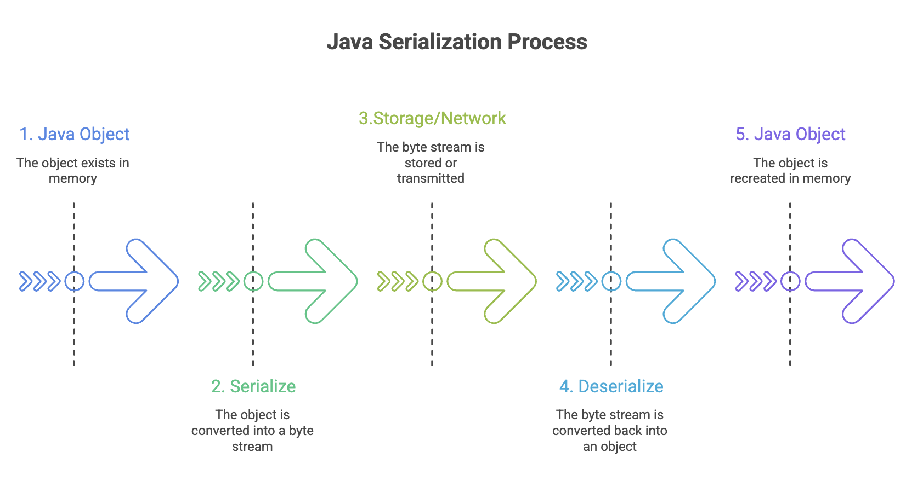

# Java Serialization

## What Is Serialization?

**Serialization** is the process of converting an object's state (its data and code) into a byte stream, allowing it to be:
- Saved to a file or database
- Transmitted over a network
- Transferred between different Java Virtual Machines (JVMs)
- Reconstructed later into its original object form (deserialization)

Think of serialization as "freezing" an object into a portable format that can travel anywhere and be "unfrozen" back into a live object.




### Why Serialization Is Needed?

Serialization solves several critical problems in software development:

### 1. Communication Between Systems

Enables multiple computer systems to share and execute objects across different JVMs, even on different architectures or operating systems.

```
JVM on Windows → Serialized Object → Network → JVM on Linux
```

### 2. Persistence

Allows saving an object's complete state to a database or file system for later retrieval, enabling data to survive beyond program execution.

```java
// Save game state
GameState gameState = new GameState(level, score, inventory);
// Serialize to file
// Later: restore exact game state from file
```

### 3. Deep Copy Cloning

Simplifies creating exact replicas of complex objects by serializing and immediately deserializing them.

```java
// Deep copy by serialization
Object copy = deserialize(serialize(originalObject));
```

### 4. Caching

Minimizes computation time by serializing large or expensive-to-create objects, storing them, and retrieving them when needed.

```java
// Cache expensive calculation results
ComplexResult result = performExpensiveCalculation();
cache.put(key, serialize(result)); // Store for quick retrieval
```

### 5. Cross-Platform Compatibility

Works across different JVMs on various architectures or operating systems, making it platform-independent.


---


## How to Make Objects Serializable

### Implementing Serializable Interface

To enable serialization, a class must implement the `java.io.Serializable` interface:

```java
import java.io.Serializable;

public class Student implements Serializable {
    private String name;
    private int age;
    private String studentId;

    public Student(String name, int age, String studentId) {
        this.name = name;
        this.age = age;
        this.studentId = studentId;
    }

    // Getters and setters
    public String getName() { return name; }
    public int getAge() { return age; }
    public String getStudentId() { return studentId; }
}
```

**Key Points:**
- `Serializable` is a **marker interface** (has no methods)
- Tells Java that objects of this class can be serialized
- All instance variables must be serializable or marked as transient
- No additional implementation required for basic serialization

### Serializing an Object

Use `ObjectOutputStream` to serialize objects to a file:

```java
import java.io.*;

public class SerializationExample {
    public static void main(String[] args) {
        Student student = new Student("Alice Johnson", 20, "STU001");

            // Create FileOutputStream
            FileOutputStream fileOut = new FileOutputStream("student.ser");

            // Wrap with ObjectOutputStream
            ObjectOutputStream objectOut = new ObjectOutputStream(fileOut);

            // Serialize the object
            objectOut.writeObject(student);

            // Close streams
            objectOut.close();
            fileOut.close();

            System.out.println("Student object serialized successfully.");
            System.out.println("Data saved to student.ser");
    }
}
```

**Process Explanation:**
1. Create a `FileOutputStream` pointing to destination file
2. Wrap it with `ObjectOutputStream` for object serialization capability
3. Call `writeObject()` method with the object to serialize
4. Close streams to ensure data is written


### File Extension Convention

- Use `.ser` extension for serialized object files
- This is a convention, not a requirement
- Makes it clear the file contains serialized Java objects


---


## Serial Version UID

The `serialVersionUID` is a unique identification number that the JVM associates with each serializable class. It's used during deserialization to verify that the sender and receiver of a serialized object have loaded classes that are compatible.

```java
import java.io.Serializable;

public class Employee implements Serializable {
    // Explicitly declare serialVersionUID
    private static final long serialVersionUID = 1L;

    private String name;
    private int employeeId;
    private double salary;

    // Constructor, getters, setters...
}
```

### Why serialVersionUID Matters?

**Without Explicit serialVersionUID:**
- JVM automatically generates one based on class structure
- If class structure changes (add/remove field), the generated UID changes
- Deserialization of old objects fails with `InvalidClassException`

**With Explicit serialVersionUID:**
- You control version compatibility
- Can modify class while maintaining backward compatibility
- Only increment when breaking compatibility intentionally

### Example of Version Mismatch

```java
// Version 1 of class (serialized objects created)
public class Product implements Serializable {
    private String name;
    private double price;
}

// Version 2 of class (trying to deserialize old objects)
public class Product implements Serializable {
    private String name;
    private double price;
    private String category; // New field added

    // Without explicit serialVersionUID, deserialization will fail!
}
```

**Best Practice:**
Always declare `serialVersionUID` explicitly:

```java
private static final long serialVersionUID = 1L;
```

Increment it when making incompatible changes:

```java
private static final long serialVersionUID = 2L; // Breaking change
```


---


## The transient Keyword

The `transient` keyword prevents a variable from being serialized. When an object is deserialized, transient fields are initialized to their default values (null for objects, 0 for numbers, false for boolean).

```java
import java.io.Serializable;

public class UserAccount implements Serializable {
    private static final long serialVersionUID = 1L;

    private String username;
    private transient String password; // Won't be serialized
    private String email;
    private transient String sessionToken; // Won't be serialized

    // Constructor, getters, setters...
}
```

### When to Use transient

1. **Security**: Sensitive data like passwords, credit card numbers
2. **Derived Fields**: Calculated values that can be recomputed
3. **Temporary State**: Session tokens, cache data
4. **Non-serializable References**: Objects that can't or shouldn't be serialized
5. **Performance**: Large objects that aren't essential to restore

### Example: Security Use Case

```java
import java.io.Serializable;

public class BankAccount implements Serializable {
    private static final long serialVersionUID = 1L;

    private String accountNumber;
    private double balance;
    private transient String pin; // Security: don't serialize PIN
    private transient String cvv; // Security: don't serialize CVV

    public BankAccount(String accountNumber, double balance, String pin, String cvv) {
        this.accountNumber = accountNumber;
        this.balance = balance;
        this.pin = pin;
        this.cvv = cvv;
    }

    // After deserialization, pin and cvv will be null
    // They must be re-authenticated, not restored from file
}
```

### Example: Derived Fields

```java
import java.io.Serializable;

public class Rectangle implements Serializable {
    private static final long serialVersionUID = 1L;

    private double width;
    private double height;
    private transient double area; // Can be recalculated

    public Rectangle(double width, double height) {
        this.width = width;
        this.height = height;
        this.area = width * height;
    }

    // After deserialization, recalculate area
    private void readObject(java.io.ObjectInputStream in)
            throws IOException, ClassNotFoundException {
        in.defaultReadObject();
        this.area = width * height; // Recalculate
    }
}
```


---


## Static Fields and Serialization

Serialization ignores `static` member fields because serialization is about saving the state of a specific instance, not class-level data.

```java
import java.io.Serializable;

public class Counter implements Serializable {
    private static final long serialVersionUID = 1L;

    private int instanceCount;
    private static int totalCount = 0; // Won't be serialized

    public Counter() {
        this.instanceCount = ++totalCount;
    }
}
```

**Key Points:**
- Static fields belong to the class, not individual objects
- Serialization saves object state, not class state
- Static fields retain their current JVM values, not serialized values
- If you need to persist static data, handle it separately


---


## Serialization with Inheritance

### Case 1: Superclass Implements Serializable

When a superclass implements `Serializable`, all subclasses automatically become serializable:

```java
import java.io.Serializable;

// Superclass is serializable
class Animal implements Serializable {
    private static final long serialVersionUID = 1L;
    protected String species;

    public Animal(String species) {
        this.species = species;
    }
}

// Subclass is automatically serializable
class Dog extends Animal {
    private String breed;

    public Dog(String species, String breed) {
        super(species);
        this.breed = breed;
    }
}
```

### Case 2: Superclass Is Not Serializable

When a superclass doesn't implement `Serializable`, subclasses can manually implement it:

```java
// Superclass is NOT serializable
class Vehicle {
    protected String manufacturer;

    public Vehicle(String manufacturer) {
        this.manufacturer = manufacturer;
    }

    // MUST have no-argument constructor for serialization to work
    public Vehicle() {
        this.manufacturer = "Unknown";
    }
}

// Subclass manually implements Serializable
class Car extends Vehicle implements Serializable {
    private static final long serialVersionUID = 1L;
    private String model;

    public Car(String manufacturer, String model) {
        super(manufacturer);
        this.model = model;
    }
}
```

**Critical Requirement:**
- Non-serializable superclass **must** have a no-argument constructor
- This constructor is called during deserialization to initialize superclass fields
- Without it, deserialization throws `InvalidClassException`

### Case 3: Preventing Subclass Serialization

You can prevent a subclass from being serialized even if the superclass is serializable:

```java
import java.io.*;

class SerializableParent implements Serializable {
    private static final long serialVersionUID = 1L;
    protected String data;
}

class NonSerializableChild extends SerializableParent {
    // Prevent serialization by throwing exception
    private void writeObject(ObjectOutputStream out) throws IOException {
        throw new NotSerializableException("This class cannot be serialized");
    }

    private void readObject(ObjectInputStream in) throws IOException {
        throw new NotSerializableException("This class cannot be deserialized");
    }
}
```


---


## Advantages and Disadvantages of Serialization

### Advantages of Serialization

| # | Advantage                            | Details                                                                                                                                                           |
| - | ------------------------------------ | ----------------------------------------------------------------------------------------------------------------------------------------------------------------- |
| 1 | Built-in Java Feature                | - No external libraries needed <br> - Part of core Java API <br> - Widely supported across Java ecosystem                                                         |
| 2 | Simple to Implement                  | - Just implement `Serializable` interface <br> - No methods to implement for basic serialization <br> - Automatic handling of object graphs                       |
| 3 | Customizable                         | - Override `writeObject()` and `readObject()` for custom behavior <br> - Control serialization using `transient` <br> - Manage versioning with `serialVersionUID` |
| 4 | Universal Support                    | - Works across different JVM implementations <br> - Cross-platform compatibility <br> - Standard mechanism understood by all Java developers                      |
| 5 | Supports Encryption and Compression  | - Can wrap streams with encryption/compression <br> - `CipherOutputStream` for encryption <br> - `GZIPOutputStream` for compression                               |
| 6 | Foundation for Critical Technologies | - RMI (Remote Method Invocation) <br> - JPA (Java Persistence API) <br> - EJB (Enterprise JavaBeans) <br> - Many caching frameworks                               |


### Disadvantages of Serialization

| # | Disadvantage                   | Details                                                                                                                           |
| - | ------------------------------ | --------------------------------------------------------------------------------------------------------------------------------- |
| 1 | Brittle Objects                | - Class structure changes can break deserialization <br> - Field type modifications may cause failures                            |
| 2 | Transient Variable Issues      | - `transient` variables become `null` after deserialization <br> - Must override `readObject()` to reinitialize                   |
| 3 | Inefficient Memory Utilization | - Includes class metadata in serialized form <br> - Larger than raw data <br> - Large object graphs increase size significantly   |
| 4 | No Concurrent Access Control   | - No built-in thread safety <br> - Requires external synchronization <br> - Race conditions possible                              |
| 5 | Security Vulnerabilities       | - Deserialization can execute arbitrary code <br> - Source of many security exploits <br> - Untrusted data can compromise systems |
| 6 | Performance Overhead           | - Slower than formats like Protocol Buffers <br> - More CPU intensive than simple formats <br> - Reflection-based overhead        |


---


## Best Practices for Serialization

### 1. Use @serial Javadoc Tag

Document serializable fields:

```java
/**
 * User account information.
 * @serial Include the user's unique identifier
 */
private String userId;
```

### 2. Use .ser File Extension

Convention for serialized object files:

```java
objectOut.writeObject(user); // Save as "user.ser"
```

### 3. Avoid Default Serialization for Static/Transient Fields

Be explicit about what gets serialized:

```java
private transient Cache cache; // Explicitly transient
private static final String VERSION = "1.0"; // Static, not serialized
```

### 4. Don't Serialize Extendable Classes

If a class is meant to be extended, reconsider serialization:

```java
// Avoid this pattern
public class ExtendableBase implements Serializable {
    // Makes all subclasses serializable, which may not be desired
}
```

### 5. Avoid Serializing Inner Classes

Inner classes capture references to outer class, causing issues:

```java
public class Outer implements Serializable {
    // Avoid serializing this
    private class Inner implements Serializable {
        // Contains implicit reference to Outer
    }
}
```

### 6. Always Declare serialVersionUID

```java
private static final long serialVersionUID = 1L;
```

### 7. Implement Custom Serialization When Needed

Override `writeObject()` and `readObject()` for complex cases:

```java
private void writeObject(ObjectOutputStream out) throws IOException {
    out.defaultWriteObject();
    // Custom serialization logic
}

private void readObject(ObjectInputStream in)
        throws IOException, ClassNotFoundException {
    in.defaultReadObject();
    // Custom deserialization logic (e.g., re-initialize transient fields)
}
```


---


## Summary 

* Serialization converts Java objects into byte streams for storage, transmission, and cross-JVM communication.

* It requires implementing the `Serializable` marker interface and properly managing `serialVersionUID` for version control.

* Fields marked as `transient` and all static fields are not serialized, ensuring better security and control over object state.

* Proper handling of inheritance, documentation, and best practices is essential for stable and maintainable serialization.


