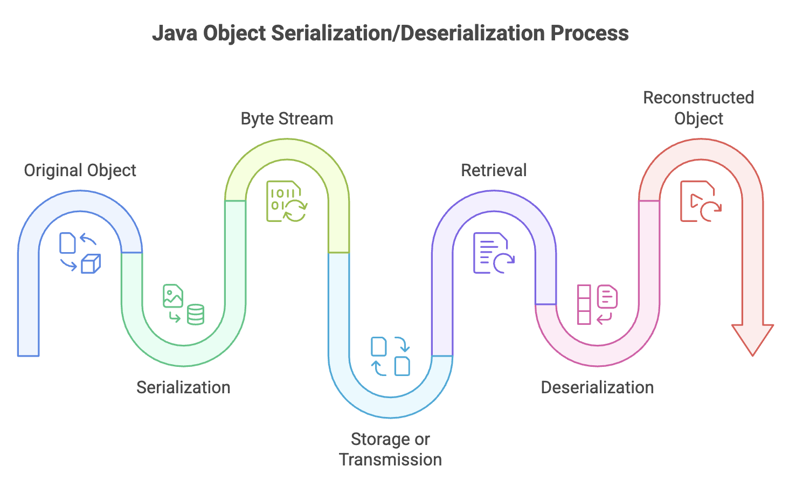
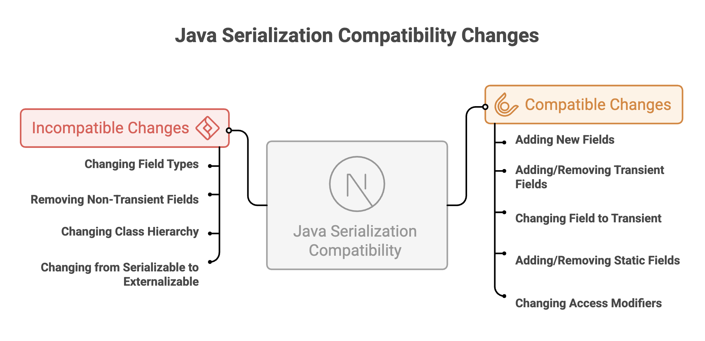

# Java Deserialization

## What Is Deserialization?

**Deserialization** is the reverse process of serialization—it reconstructs a Java object from its byte stream representation. Where serialization "freezes" an object into a portable format, deserialization "unfreezes" it back into a live, usable object in memory.

### The Complete Cycle

The complete cycle enables:
- Restoring saved application state
- Receiving objects over a network
- Loading cached data
- Sharing objects between different JVMs




---


## How Deserialization Works

### Basic Deserialization

Use `ObjectInputStream` to deserialize objects from a file or stream:

```java
import java.io.*;

public class DeserializationExample {
    public static void main(String[] args) {
        try {
            // Create FileInputStream to read from file
            FileInputStream fileIn = new FileInputStream("student.ser");

            // Wrap with ObjectInputStream for object deserialization
            ObjectInputStream objectIn = new ObjectInputStream(fileIn);

            // Deserialize the object
            Student student = (Student) objectIn.readObject();

            // Close streams
            objectIn.close();
            fileIn.close();

            // Use the deserialized object
            System.out.println("Student deserialized successfully:");
            System.out.println("Name: " + student.getName());
            System.out.println("Age: " + student.getAge());
            System.out.println("ID: " + student.getStudentId());

        } catch (IOException e) {
            System.out.println("I/O error during deserialization");
            e.printStackTrace();
        } catch (ClassNotFoundException e) {
            System.out.println("Student class not found");
            e.printStackTrace();
        }
    }
}
```

**Key Points:**
1. Create `FileInputStream` pointing to the serialized file
2. Wrap it with `ObjectInputStream` for object reconstruction
3. Call `readObject()` method (returns `Object` type)
4. Cast the result to the expected type
5. Handle both `IOException` and `ClassNotFoundException`

### Understanding readObject()

The `readObject()` method:
- Returns type `Object` (must be cast to actual type)
- Throws `ClassNotFoundException` if the class isn't available in classpath
- Throws `IOException` for file/stream errors
- Can throw `InvalidClassException` if serialVersionUID mismatches

```java
// Type casting is required
Student student = (Student) objectIn.readObject();
```


---


## Handling Transient Fields During Deserialization

### The Problem

Transient fields are initialized to default values during deserialization:
- Objects: `null`
- Integers: `0`
- Booleans: `false`
- Doubles: `0.0`

This can cause problems if these fields need specific initialization.

### Solution: Custom readObject()

Override `readObject()` to manually initialize transient fields:

```java
import java.io.*;

class DatabaseConnection implements Serializable {
    private static final long serialVersionUID = 1L;

    private String username;
    private String serverUrl;
    private transient Connection connection; // Can't serialize database connections

    public DatabaseConnection(String username, String serverUrl) {
        this.username = username;
        this.serverUrl = serverUrl;
        this.connection = establishConnection();
    }

    private Connection establishConnection() {
        // Simulate creating database connection
        System.out.println("Establishing connection to " + serverUrl);
        return new Connection(serverUrl);
    }

    // Custom deserialization
    private void readObject(ObjectInputStream in)
            throws IOException, ClassNotFoundException {

        // First, perform default deserialization
        in.defaultReadObject();

        // Then, manually initialize transient fields
        this.connection = establishConnection();
        System.out.println("Transient connection re-established after deserialization");
    }

    @Override
    public String toString() {
        return "DatabaseConnection{username='" + username +
               "', serverUrl='" + serverUrl +
               "', connection=" + (connection != null ? "active" : "null") + "}";
    }
}

// Mock Connection class
class Connection {
    private String url;

    public Connection(String url) {
        this.url = url;
    }
}
```


---


## Version Compatibility and Evolution

### Understanding serialVersionUID

The `serialVersionUID` is critical for maintaining compatibility between different versions of a class:

```java
// Version 1
class Product implements Serializable {
    private static final long serialVersionUID = 1L;

    private String name;
    private double price;
}

// Version 2 - Compatible change
class Product implements Serializable {
    private static final long serialVersionUID = 1L; // Same UID

    private String name;
    private double price;
    private String category = "General"; // New field with default value
}
```

### Java Serialization Compatibility Changes




### Handling Version Evolution

```java
import java.io.*;

class Employee implements Serializable {
    private static final long serialVersionUID = 2L; // Incremented version

    private String name;
    private double salary;
    private String department; // New field in version 2

    // Custom deserialization to handle old version
    private void readObject(ObjectInputStream in)
            throws IOException, ClassNotFoundException {

        in.defaultReadObject();

        // If department is null (from old version), set default
        if (this.department == null) {
            this.department = "Unassigned";
        }
    }
}
```


---


## Best Practices for Deserialization

### 1. Validate Input

Never deserialize untrusted data without validation:

```java
public Object safeDeserialize(String filename) {
    try (ObjectInputStream in = new ObjectInputStream(
            new FileInputStream(filename))) {

        // Validate before deserializing
        if (!isValidSource(filename)) {
            throw new SecurityException("Untrusted source");
        }

        return in.readObject();

    } catch (Exception e) {
        e.printStackTrace();
        return null;
    }
}
```

### 2. Use Try-with-Resources

Ensure streams are properly closed:

```java
try (ObjectInputStream in = new ObjectInputStream(
        new FileInputStream("data.ser"))) {
    return in.readObject();
} // Automatically closes
```

### 3. Handle All Exceptions

Account for various failure scenarios:

```java
try {
    // Deserialization
} catch (InvalidClassException e) {
    // Version mismatch
} catch (ClassNotFoundException e) {
    // Missing class
} catch (IOException e) {
    // I/O problems
}
```

### 4. Initialize Transient Fields

Override `readObject()` when needed:

```java
private void readObject(ObjectInputStream in)
        throws IOException, ClassNotFoundException {
    in.defaultReadObject();
    // Initialize transient fields
    this.cache = new HashMap<>();
}
```

### 5. Consider JSON for New Projects

For new applications, prefer JSON:
- Better cross-platform support
- Easier debugging
- More secure
- Industry standard for web services


---


## Summary

* Deserialization reconstructs Java objects from byte streams, reversing the serialization process using `readObject()`

* Proper exception handling (`IOException`, `ClassNotFoundException`, `InvalidClassException`) and type casting are required during deserialization.

* `serialVersionUID` ensures version compatibility, and transient fields are restored with default values unless manually reinitialized.

* Streams must be managed carefully using try-with-resources to prevent resource leaks.

* Deserializing untrusted data poses serious security risks and should always be validated.

* For cross-platform communication, JSON is the modern standard, while native Java serialization is best suited for JVM-to-JVM communication.
