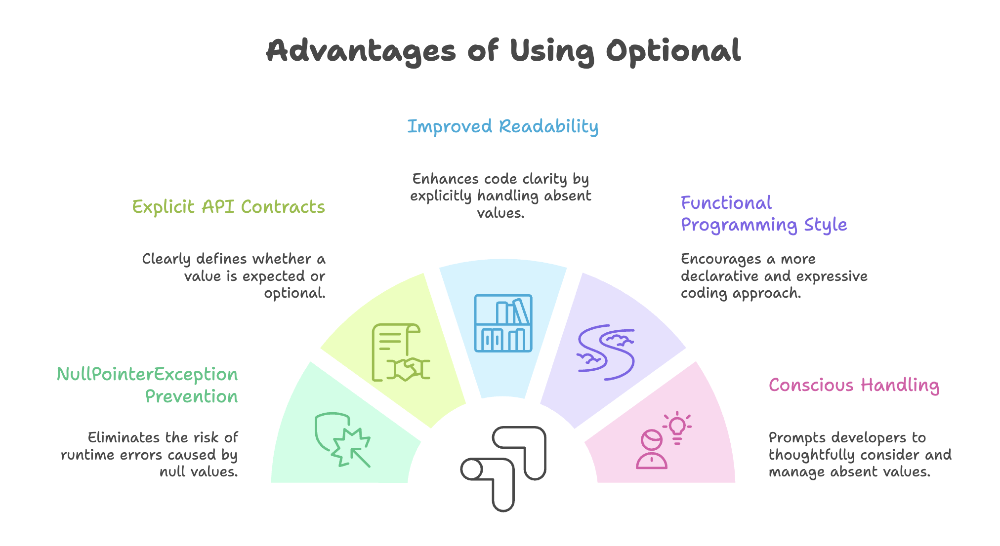
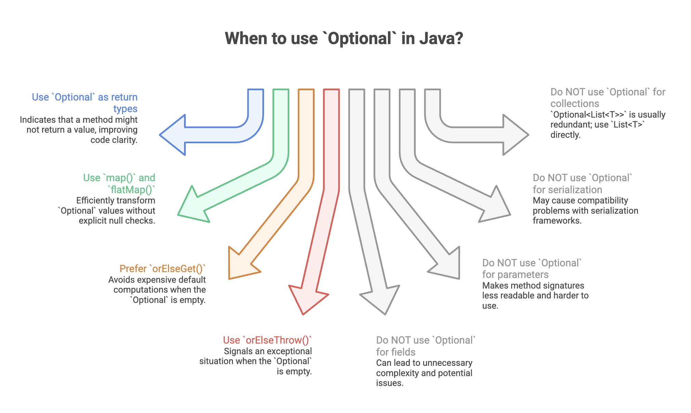

# Optional Class in Java

The `Optional` class, introduced in **Java 8**, is a container object designed to represent the presence or absence of a value in a clear and expressive way. It provides a structured alternative to returning `null`, helping developers avoid one of Java’s most common runtime problems: `NullPointerException` (NPE).

Rather than returning `null`, a method can return an `Optional<T>`, making the possibility of “no value” explicit in the method signature and encouraging safer handling.

---

## The Problem with `null`

Before Java 8, methods that could not produce a result typically returned `null`.

```java
// Traditional approach with null
public Cat findCatById(int id) {
    // If cat not found, return null
    return null;
}

// Calling code must remember to check for null
Cat cat = findCatById(5);
if (cat != null) {
    int age = cat.getAge(); // Safe
} else {
    // Handle null case
}
```

### Problems with this approach

* Easy to forget null checks → leads to `NullPointerException`
* Method signature does not indicate that `null` may be returned
* Repetitive and verbose null-checking logic
* Null-handling responsibility pushed to the caller

This lack of explicitness makes APIs fragile and error-prone.


---


## What is `Optional`?

`Optional<T>` is a container object that:

* May contain a non-null value
* May be empty (contain no value)

It forces developers to explicitly handle both scenarios.

Think of `Optional` as a box:

* Contains a value → `Optional.of(value)`
* Empty → `Optional.empty()`




---


## Creating Optional Objects

Java provides three factory methods to create `Optional` instances.

### `Optional.of(value)`

Use when the value is guaranteed to be non-null.

```java
Optional<String> optionalName = Optional.of("John");
```

If the value is `null`, it throws `NullPointerException` immediately:

```java
Optional<String> nullOptional = Optional.of(null); // Throws NPE
```

**When to use:**
When you are absolutely certain the value is not null and want to fail fast if it is.


### `Optional.ofNullable(value)`

Use when the value may be null.

```java
String name = getUserName(); // Might return null
Optional<String> optionalName = Optional.ofNullable(name);

Optional<String> emptyOptional = Optional.ofNullable(null); // Safe
```

**When to use:**
When dealing with external systems (database, API, user input) where null is possible.


### `Optional.empty()`

Explicitly creates an empty `Optional`.

```java
Optional<String> emptyOptional = Optional.empty();
```

Example in a method:

```java
public Optional<Cat> findCatById(int id) {
    if (catExists(id)) {
        return Optional.of(getCat(id));
    }
    return Optional.empty();
}
```

**When to use:**
When intentionally returning “no value”.


---


## Working with Optional

### Checking Presence - `isPresent()`

```java
Optional<String> optionalName = Optional.of("Alice");

if (optionalName.isPresent()) {
    System.out.println(optionalName.get());
}
```

⚠ **Not Recommended Pattern**

Using `isPresent()` + `get()` is similar to traditional null checks and defeats the purpose of `Optional`.

Prefer functional alternatives like `map()`, `orElse()`, etc.


### Retrieving Values - `get()`

```java
Optional<String> optionalName = Optional.of("Bob");
String name = optionalName.get(); // OK

Optional<String> empty = Optional.empty();
empty.get(); // Throws NoSuchElementException
```

> Use `get()` only when you are absolutely certain the value is present.


---


## Providing Default Values

### `orElse(defaultValue)`

Returns the value if present, otherwise returns the provided default.

```java
Optional<String> optionalName = Optional.empty();
String name = optionalName.orElse("Default Name");
```

If value exists:

```java
Optional<Integer> optionalAge = Optional.of(25);
int age = optionalAge.orElse(0); // 25
```

**Use case:**
When the default value is simple and inexpensive.


### `orElseGet(Supplier)`

Executes the supplier only if the Optional is empty.

```java
String name = optionalName.orElseGet(() -> generateDefaultName());
```

Example:

```java
int age = findCatById(5)
    .map(Cat::getAge)
    .orElseGet(() -> 0);
```

**When to use:**
When default value creation is expensive or has side effects.

### Performance Note

`orElse()` evaluates its argument immediately.
`orElseGet()` evaluates lazily (only if needed).


### `orElseThrow()`

Throws `NoSuchElementException` if empty.

```java
optionalName.orElseThrow();
```


### `orElseThrow(Supplier)`

Throws a custom exception if empty.

```java
Cat cat = findCatById(5)
    .orElseThrow(() -> 
        new CatNotFoundException("Cat not found"));
```

**Use case:**
When absence of value is exceptional.


---


## Functional Transformations

### `map(Function)`

Transforms the value if present.

```java
Optional<String> optionalName = Optional.of("john");

String upper = optionalName
    .map(String::toUpperCase)
    .orElse("UNKNOWN");
```

If empty, transformation is skipped.


### `flatMap(Function)`

Used when the mapping function itself returns an `Optional`.

```java
Optional<User> user = getUser();

Optional<Address> address = user
    .flatMap(User::getAddress);
```

Prevents nested `Optional<Optional<T>>`.


---


## Conditional Execution

### `ifPresent(Consumer)`

Executes only if value exists.

```java
optionalName.ifPresent(name ->
    System.out.println("Hello " + name));
```


### `ifPresentOrElse(Consumer, Runnable)` (Java 9+)

```java
optionalName.ifPresentOrElse(
    name -> System.out.println("Found: " + name),
    () -> System.out.println("Not found")
);
```


---


## Real-World Example

### Before Optional

```java
public int getCatAge(int catId) {
    Cat cat = findCatById(catId);
    if (cat != null) {
        return cat.getAge();
    }
    return 0;
}
```

### After Optional

```java
public Optional<Cat> findCatById(int id) {
    return Optional.ofNullable(database.getCat(id));
}

public int getCatAge(int catId) {
    return findCatById(catId)
        .map(Cat::getAge)
        .orElse(0);
}

public String getCatNameUpperCase(int catId) {
    return findCatById(catId)
        .map(Cat::getName)
        .map(String::toUpperCase)
        .orElse("UNKNOWN");
}
```

Client code becomes expressive:

```java
service.findCatById(5)
    .ifPresentOrElse(
        cat -> System.out.println(cat.getName()),
        () -> System.out.println("Cat not found")
    );
```

---





---


## Summary

* Represents the presence or absence of a value explicitly, avoiding null.

* Helps prevent NullPointerException by enforcing safer handling.

* Supports functional-style operations like map(), flatMap(), and orElse().

* Makes method contracts clearer by signaling optional return values.

* Best used as a return type to design safer and more expressive APIs.
