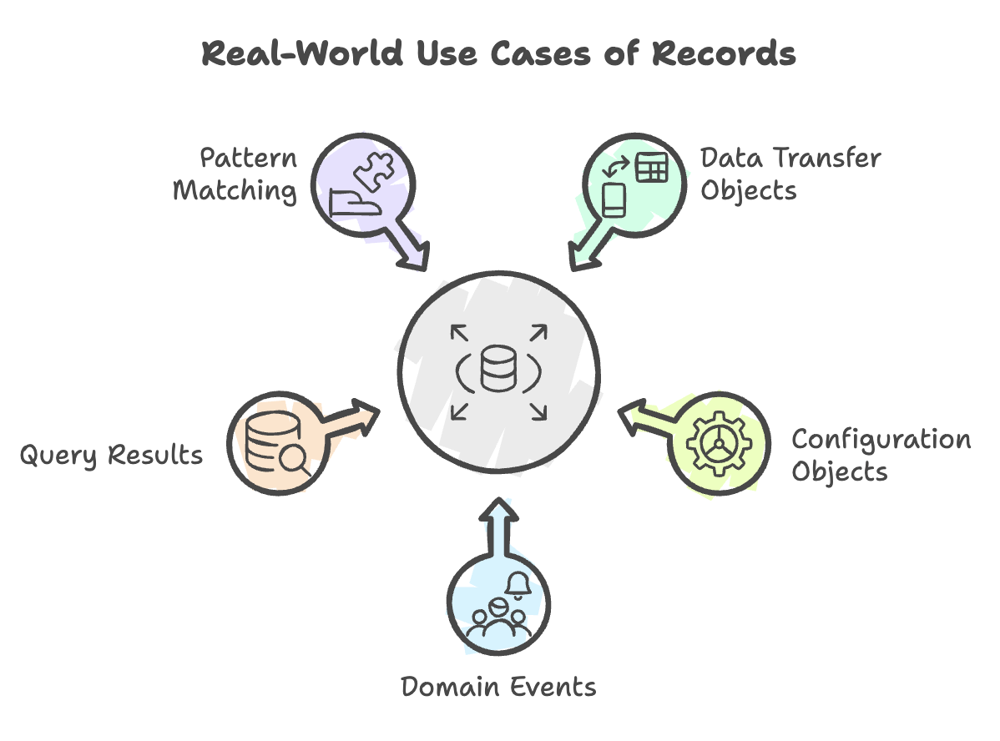
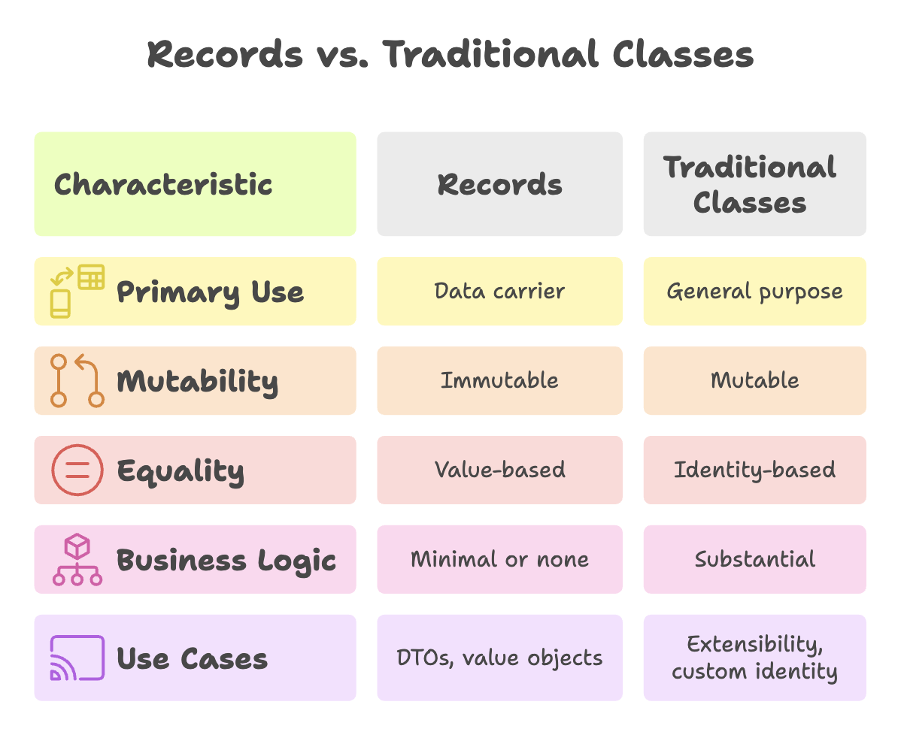

# Record Classes in Java

Record classes are introduced as a **preview feature in Java 14** and **standardized in Java 16**, a revolutionary addition to the Java language designed to reduce boilerplate code when creating simple data carrier classes drastically. They represent a shift toward more concise and expressive code, making Java competitive with modern languages while maintaining type safety and clarity.


## The Problem: Verbose Data Classes

Before records, creating a simple class to hold data required an enormous amount of boilerplate code. Let's examine a typical scenario:

### Traditional Approach (Before Records)

Suppose we want to create an `Alien` class to represent an alien with an `id` and `name`:

```java
public class Alien {
    // 1. Private final fields for immutability
    private final int id;
    private final String name;

    // 2. Parameterized constructor
    public Alien(int id, String name) {
        this.id = id;
        this.name = name;
    }

    // 3. Getter methods
    public int getId() {
        return id;
    }

    public String getName() {
        return name;
    }

    // 4. Override equals() for value-based comparison
    @Override
    public boolean equals(Object o) {
        if (this == o) return true;
        if (o == null || getClass() != o.getClass()) return false;
        Alien alien = (Alien) o;
        return id == alien.id && Objects.equals(name, alien.name);
    }

    // 5. Override hashCode() for proper hashing
    @Override
    public int hashCode() {
        return Objects.hash(id, name);
    }

    // 6. Override toString() for readable output
    @Override
    public String toString() {
        return "Alien{id=" + id + ", name='" + name + "'}";
    }
}
```

> Approximately **40-50 lines of code** for a simple two-field data class!

### Problems with Traditional Approach

1. **Excessive Boilerplate**: Most code is mechanical and repetitive
2. **Error-Prone**: Easy to make mistakes in `equals()`, `hashCode()`, or forget to update them when adding fields
3. **Maintenance Burden**: Adding a new field requires updating multiple methods
4. **Reduced Readability**: The actual purpose (holding data) is obscured by implementation details
5. **Time-Consuming**: Writing and testing all this code takes significant development time

## The Solution: Record Classes

Record classes solve all these problems with a single line of code:

```java
public record Alien(int id, String name) {
}
```

That's it! This **single declaration** automatically provides:
- Private final fields
- Canonical constructor
- Getter methods
- `equals()` method
- `hashCode()` method
- `toString()` method


---


## Understanding Record

### Basic Syntax

```java
[access-modifier] record RecordName(ComponentType1 component1, ComponentType2 component2, ...) {
    // Optional: custom methods, constructors, static members
}
```

### Components

The parameters in parentheses are called **components**. They define:
- The record's state (fields)
- The parameters for the canonical constructor
- The accessor methods that will be generated

```java
record Person(String firstName, String lastName, int age) {
}

// Components: firstName, lastName, age
// This automatically creates:
// - private final String firstName;
// - private final String lastName;
// - private final int age;
```





---


## Automatic Features of Records

### 1. Canonical Constructor

A public constructor with all components that cannot leave any component uninitialized.

```java
record Alien(int id, String name) {
}

// Usage
Alien alien = new Alien(1, "Naveen");
System.out.println(alien); // Output: Alien[id=1, name=Naveen]
```

**Behind the scenes**, this is equivalent to:

```java
public Alien(int id, String name) {
    this.id = id;
    this.name = name;
}
```

### 2. Accessor Methods (Getters)

Record classes provide accessor methods, but with a **different naming convention** than traditional Java Beans:

```java
record Alien(int id, String name) {
}

Alien alien = new Alien(1, "Naveen");

// Traditional class would use: alien.getId(), alien.getName()
// Record uses component names directly:
int alienId = alien.id();       // NOT getId()
String alienName = alien.name(); // NOT getName()

System.out.println("ID: " + alien.id());     // Output: ID: 1
System.out.println("Name: " + alien.name()); // Output: Name: Naveen
```

**Why this naming?** It's more concise and aligns with the record's component-based design.

### 3. toString() Method

Records automatically generate a meaningful `toString()` implementation:

```java
record Alien(int id, String name) {
}

Alien alien = new Alien(1, "Naveen");
System.out.println(alien);
// Output: Alien[id=1, name=Naveen]
```

**Format**: `RecordName[component1=value1, component2=value2, ...]`

This is extremely useful for debugging and logging.

### 4. equals() Method

Records implement value-based equality, comparing all components:

```java
record Alien(int id, String name) {
}

Alien alien1 = new Alien(1, "Naveen");
Alien alien2 = new Alien(1, "Naveen");
Alien alien3 = new Alien(2, "Rahul");

System.out.println(alien1.equals(alien2)); // true (same values)
System.out.println(alien1.equals(alien3)); // false (different id)
System.out.println(alien1 == alien2);      // false (different objects)
```

**Important**: Two records are equal if:
- They are of the same record type
- All their corresponding components are equal

### 5. hashCode() Method

A proper `hashCode()` implementation is automatically provided, consistent with `equals()`:

```java
record Alien(int id, String name) {
}

Alien alien1 = new Alien(1, "Naveen");
Alien alien2 = new Alien(1, "Naveen");

System.out.println(alien1.hashCode());
System.out.println(alien2.hashCode());
// Both will have the same hash code

// Records work correctly in hash-based collections
Set<Alien> aliens = new HashSet<>();
aliens.add(alien1);
aliens.add(alien2);
System.out.println(aliens.size()); // Output: 1 (treated as duplicates)
```


---


## Immutability of Record

### Records are Immutable by Default

All fields in a record are **implicitly `private` and `final`**, meaning:
- Fields cannot be modified after construction
- No setter methods are generated
- Records are inherently thread-safe

```java
record Alien(int id, String name) {
}

Alien alien = new Alien(1, "Naveen");
// alien.id = 2;          // COMPILATION ERROR: Cannot access private field
// No setId() method exists
```

**Why Immutability?**
- **Thread Safety**: Safe to use in multi-threaded environments
- **Predictability**: Object state cannot change unexpectedly
- **Cache-Friendly**: Can be safely cached and shared
- **Functional Programming**: Aligns with functional programming principles

### Caution with Mutable Components

While the record reference is immutable, if components contain mutable objects, their internal state can still change:

```java
record Person(String name, List<String> hobbies) {
}

Person person = new Person("Alice", new ArrayList<>(List.of("Reading")));
person.hobbies().add("Gaming"); // This works! List is mutable

System.out.println(person);
// Output: Person[name=Alice, hobbies=[Reading, Gaming]]
```

**Best Practice**: Use immutable collections for true immutability:

```java
record Person(String name, List<String> hobbies) {
    // Defensive copy in constructor
    public Person {
        hobbies = List.copyOf(hobbies); // Creates immutable copy
    }
}
```


## Limitations and Restrictions

### 1. Cannot Extend Classes: 

Records implicitly extend `java.lang.Record`, so they cannot extend any other class.

**Reason**: Java doesn't support multiple inheritance, and records already extend `Record`.

### 2. Cannot Define Additional Instance Fields

All instance states must be declared as components in the record header because records are designed to be pure data carriers with explicit state.

### 3. Records are Implicitly Final

You **cannot** extend a record, they are implicitly `final`, preventing inheritance.

### 4. Can Implement Interfaces

Records can implement interfaces, making them flexible for polymorphism.





---


## Summary

* Provide a concise way to define immutable data carriers with minimal boilerplate.
* Automatically generate constructor, accessors, `equals()`, `hashCode()`, and `toString()`.
* Promote immutability, improving thread safety and predictability.
* Clearly express intent as value-based data objects (ideal for DTOs and value objects).
* Support validation and custom behavior while maintaining type safety and clarity.
