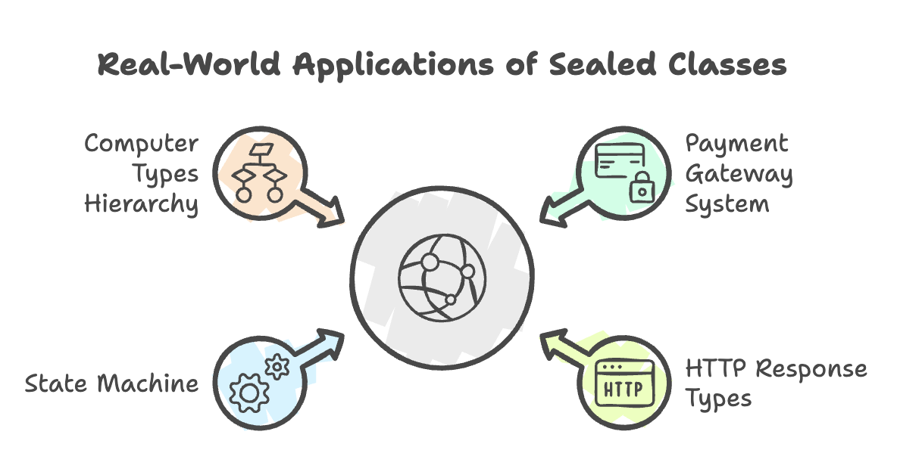

# Sealed Classes in Java

### Introduction

**Sealed classes**, introduced as a **preview feature in Java 15** and **finalized in Java 17**, provide a powerful mechanism for controlling class hierarchies. They allow developers to explicitly declare which classes or interfaces are permitted to extend or implement them, offering a middle ground between the complete openness of regular classes and the complete restriction of final classes.

This feature enhances Java's type system by providing:
- **Fine-grained control** over inheritance hierarchies
- **Better domain modeling** for closed sets of subtypes
- **Improved pattern matching** with exhaustive checking
- **Enhanced security** by preventing unwanted extensions


---


## Understanding the Inheritance Spectrum

Before sealed classes, Java provided two extremes for inheritance control:

### 1. Abstract/Regular Classes (Fully Open)

```java
// Abstract class - CAN be extended by any class
abstract class Animal {
    abstract void makeSound();
}

// Any class can extend Animal
class Dog extends Animal {
    void makeSound() { System.out.println("Woof"); }
}

class Cat extends Animal {
    void makeSound() { System.out.println("Meow"); }
}

// Even this is allowed (might not be desired)
class Spaceship extends Animal {
    void makeSound() { System.out.println("Whoosh"); }
}
```

**Characteristics:**
- ✅ Allows unlimited extensibility
- ✅ Flexible for library design
- ❌ No control over who extends the class
- ❌ Cannot make assumptions about all possible subtypes

### 2. Final Classes (Fully Closed)

```java
// Final class - CANNOT be extended at all
final class ImmutableString {
    private final String value;

    ImmutableString(String value) {
        this.value = value;
    }
}

// This will NOT compile
class CustomString extends ImmutableString {
}
```

**Characteristics:**
- ✅ Prevents any extension
- ✅ Guarantees no subclasses exist
- ❌ No extensibility at all
- ❌ Too restrictive for many use cases

### 3. Sealed Classes (Controlled Middle Ground) 

```java
// Sealed class - CAN ONLY be extended by permitted classes
sealed class Animal permits Dog, Cat {
    abstract void makeSound();
}

final class Dog extends Animal {
    void makeSound() { System.out.println("Woof"); }
}

final class Cat extends Animal {
    void makeSound() { System.out.println("Meow"); }
}

// This will NOT compile - Spaceship is not permitted
class Spaceship extends Animal {
}
```

**Characteristics:**
- ✅ Controlled extensibility
- ✅ Explicit permitted subtypes
- ✅ Compiler knows all possible subtypes
- ✅ Perfect for domain modeling


---


## The Need for Sealed Classes

### Problem Scenario

Imagine you're designing a payment system. You want to support exactly three payment methods: Credit Card, PayPal, and Bank Transfer. You don't want developers to add arbitrary payment methods without your knowledge.

**Before Sealed Classes:**

```java
abstract class Payment {
    abstract void process();
}

// These are the intended implementations
class CreditCardPayment extends Payment {
    void process() { /* ... */ }
}

class PayPalPayment extends Payment {
    void process() { /* ... */ }
}

class BankTransferPayment extends Payment {
    void process() { /* ... */ }
}

// Problem: Anyone can add new payment types
class CryptoCurrencyPayment extends Payment {
    void process() { /* ... */ }
}

// This breaks your system's assumptions!
```

**With Sealed Classes:**

```java
sealed class Payment permits CreditCardPayment, PayPalPayment, BankTransferPayment {
    abstract void process();
}

final class CreditCardPayment extends Payment {
    void process() { /* Credit card logic */ }
}

final class PayPalPayment extends Payment {
    void process() { /* PayPal logic */ }
}

final class BankTransferPayment extends Payment {
    void process() { /* Bank transfer logic */ }
}

// This will NOT compile - CryptoCurrencyPayment is not permitted
class CryptoCurrencyPayment extends Payment {
    void process() { /* ... */ }
}
```


---


## Sealed Class Syntax

### Basic Syntax

```java
sealed class ClassName permits Subclass1, Subclass2, Subclass3 {
    // Class body
}
```

### Components

1. **`sealed` keyword**: Declares the class as sealed
2. **`permits` clause**: Lists allowed subclasses (comma-separated)
3. **Permitted subclasses**: Must be accessible and in the same module/package

### Example

```java
// Sealed base class
sealed class Shape permits Circle, Rectangle, Triangle {
    abstract double area();
}

// Permitted subclasses must be declared as final, sealed, or non-sealed
final class Circle extends Shape {
    private final double radius;

    Circle(double radius) {
        this.radius = radius;
    }

    @Override
    double area() {
        return Math.PI * radius * radius;
    }
}

final class Rectangle extends Shape {
    private final double width;
    private final double height;

    Rectangle(double width, double height) {
        this.width = width;
        this.height = height;
    }

    @Override
    double area() {
        return width * height;
    }
}

final class Triangle extends Shape {
    private final double base;
    private final double height;

    Triangle(double base, double height) {
        this.base = base;
        this.height = height;
    }

    @Override
    double area() {
        return 0.5 * base * height;
    }
}
```

## Permitted Subclass Modifiers

Every class that extends a sealed class **must** be declared with one of three modifiers:

### 1. `final` - Cannot Be Extended Further

```java
sealed class Animal permits Dog, Cat {
}

// Final: Ends the inheritance chain here
final class Dog extends Animal {
    void bark() { System.out.println("Woof!"); }
}

// This will NOT compile
class GermanShepherd extends Dog {
}
```

**When to use:**
- When you don't want any further subclasses
- For concrete implementations at the end of the hierarchy
- Most common choice for permitted subclasses

### 2. `sealed` - Can Be Extended by Specific Classes

```java
sealed class Animal permits Mammal, Bird {
}

// Sealed: Can be extended, but only by permitted classes
sealed class Mammal extends Animal permits Dog, Cat {
}

final class Dog extends Mammal {
}

final class Cat extends Mammal {
}

// This will NOT compile
class Lion extends Mammal {
}
```

**When to use:**
- When you need multi-level controlled hierarchies
- For creating intermediate abstract layers
- When you want to further restrict who can extend

### 3. `non-sealed` - Opens Up Extension Again

```java
sealed class Animal permits Mammal, Bird {
}

// Non-sealed: Any class can extend this
non-sealed class Mammal extends Animal {
}

// Now anyone can extend Mammal
class Dog extends Mammal {
}

class Cat extends Mammal {
}

class Lion extends Mammal {
}
```

**When to use:**
- When you want to allow unrestricted extension at a certain point
- For plugin architectures or extensibility points
- Useful for library design

**Caution:** Using `non-sealed` breaks the closed hierarchy, so use it carefully.


---


## Sealed Interfaces

Interfaces can also be sealed, with the same benefits:

### Basic Sealed Interface

```java
sealed interface Vehicle permits Car, Motorcycle, Bicycle {
    void move();
}

final class Car implements Vehicle {
    public void move() {
        System.out.println("Car drives");
    }
}

final class Motorcycle implements Vehicle {
    public void move() {
        System.out.println("Motorcycle rides");
    }
}

final class Bicycle implements Vehicle {
    public void move() {
        System.out.println("Bicycle pedals");
    }
}

// This will NOT compile
class Scooter implements Vehicle {
}
```

### Combining Sealed Interfaces and Classes

```java
sealed interface Shape permits Circle, Rectangle {
}

// Records can implement sealed interfaces (Java 16+)
record Circle(double radius) implements Shape {
    public double area() {
        return Math.PI * radius * radius;
    }
}

record Rectangle(double width, double height) implements Shape {
    public double area() {
        return width * height;
    }
}
```





---


## Summary

* Restrict inheritance by explicitly controlling which classes or interfaces can extend or implement a type.
* Use the `sealed` keyword with a `permits` clause; permitted subclasses must be `final`, `sealed`, or `non-sealed`.
* Enable precise modeling of closed hierarchies with a fixed and known set of subtypes.
* Improve maintainability and security by preventing unintended extensions.
* Support exhaustive pattern matching, especially with modern `switch` expressions.
* Work effectively with records and pattern matching for cleaner, type-safe domain design.
