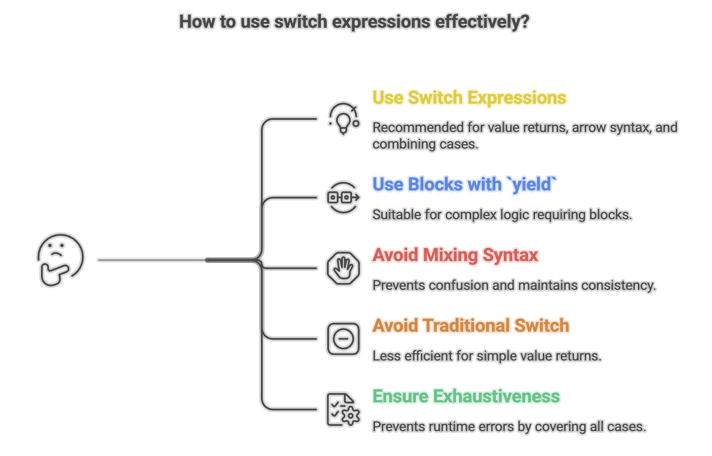

# Switch Expressions in Java

**Switch expressions**, introduced as a **preview feature in Java 12-13** and **standardized in Java 14**, represent a significant evolution of the traditional switch statement. They transform switch from a control flow statement into an expression that can return values, eliminating common pitfalls like fall-through bugs while making code more concise, readable, and type-safe.

Switch expressions are further enhanced in **Java 17** and **Java 21** with pattern matching support, making them even more powerful for modern Java development.


## Understanding Traditional Switch Statements

Before diving into switch expressions, let's understand the traditional switch statement and its limitations.

### Basic Switch Statement Syntax

```java
int dayNumber = 3;

switch (dayNumber) {
    case 1:
        System.out.println("Monday");
        break;
    case 2:
        System.out.println("Tuesday");
        break;
    case 3:
        System.out.println("Wednesday");
        break;
    case 4:
        System.out.println("Thursday");
        break;
    case 5:
        System.out.println("Friday");
        break;
    case 6:
        System.out.println("Saturday");
        break;
    case 7:
        System.out.println("Sunday");
        break;
    default:
        System.out.println("Invalid day number");
}
```

### Traditional Switch: What It Does

A switch statement is a **multi-way branch statement** that:
- Tests a variable against multiple values (called **cases**)
- Executes the corresponding code block when a match is found
- Provides an alternative to long if-else-if ladders
- Improves code readability for discrete, known values

### Supported Data Types (Traditional Switch)

Traditional switch statements work with:

**Primitive Types:**
- `byte`
- `short`
- `char`
- `int`

**Reference Types:**
- `String` (since Java 7)
- Enum types
- Wrapper classes: `Byte`, `Short`, `Character`, `Integer`


---


## The Problems with Traditional Switch

### 1. Fall-Through Behavior

The most notorious problem with traditional switch is **fall-through**: if you forget a `break` statement, execution continues into the next case.

```java
int dayNumber = 2;

switch (dayNumber) {
    case 1:
        System.out.println("Monday");
        // Forgot break!
    case 2:
        System.out.println("Tuesday");
        // Forgot break!
    case 3:
        System.out.println("Wednesday");
        break;
    default:
        System.out.println("Other day");
}

// Output (BUG!):
// Tuesday
// Wednesday
```

**Problem:** Even though `dayNumber` is 2, it prints both "Tuesday" and "Wednesday" because of the missing `break` after case 2.

### 2. Cannot Return Values Directly

Traditional switch is a statement, not an expression, so it cannot return values:

```java
// Verbose approach with traditional switch
String dayType;
int dayNumber = 3;

switch (dayNumber) {
    case 1:
    case 2:
    case 3:
    case 4:
    case 5:
        dayType = "Weekday";
        break;
    case 6:
    case 7:
        dayType = "Weekend";
        break;
    default:
        dayType = "Invalid";
        break;
}

System.out.println(dayType); // Requires separate variable
```

### 3. Verbose Syntax

Each case requires explicit `break` statements and verbose syntax:

```java
// Repetitive and error-prone
switch (value) {
    case CASE1:
        doSomething();
        break;
    case CASE2:
        doSomethingElse();
        break;
    // ... more cases with breaks
}
```

### 4. No Exhaustiveness Checking

The compiler doesn't verify that all possible values are handled (except for enums in some contexts).


---


## Switch Expressions: The Modern Solution

Switch expressions solve all these problems by:
- **Returning values** directly
- **Eliminating fall-through** with arrow syntax
- **Enforcing exhaustiveness** for completeness
- **Reducing verbosity** with concise syntax

### Basic Syntax: Arrow Form (->)

```java
String dayType = switch (dayNumber) {
    case 1, 2, 3, 4, 5 -> "Weekday";
    case 6, 7 -> "Weekend";
    default -> "Invalid";
};

System.out.println(dayType); // Direct assignment!
```

**Key Differences:**
- Uses `->` (arrow) instead of `:`
- No `break` needed (no fall-through)
- Returns a value directly
- Multiple cases can be combined with commas


---


## Switch Expression Features

### 1. Arrow Syntax (->)

The arrow syntax naturally prevents fall-through:

```java
int dayNumber = 2;

String day = switch (dayNumber) {
    case 1 -> "Monday";
    case 2 -> "Tuesday";
    case 3 -> "Wednesday";
    case 4 -> "Thursday";
    case 5 -> "Friday";
    case 6 -> "Saturday";
    case 7 -> "Sunday";
    default -> "Invalid day";
};

System.out.println(day); // Output: Tuesday
```

**Benefits:**
- Clean, concise syntax
- No accidental fall-through
- Single expression per case
- Direct value return

### 2. Multiple Case Labels

Combine multiple cases with commas:

```java
String dayType = switch (dayNumber) {
    case 1, 2, 3, 4, 5 -> "Weekday";
    case 6, 7 -> "Weekend";
    default -> "Invalid";
};
```

### 3. Block Syntax with `yield`

For complex logic requiring multiple statements, use a block with `yield`:

```java
int dayNumber = 4;

int numLetters = switch (dayNumber) {
    case 1, 5 -> {
        System.out.println("It's a weekday!");
        yield 6; // Returns 6
    }
    case 2, 4 -> {
        System.out.println("Another weekday.");
        yield 7; // Returns 7
    }
    case 3 -> {
        System.out.println("Wednesday!");
        yield 9; // Returns 9
    }
    case 6, 7 -> {
        System.out.println("Weekend!");
        yield 8; // Returns 8
    }
    default -> {
        System.out.println("Invalid day");
        yield 0; // Returns 0
    }
};

System.out.println("Number of letters: " + numLetters);
// Output:
// Another weekday.
// Number of letters: 7
```

**Key Points:**
- Use `yield` instead of `return` to return a value from a block
- Blocks allow multiple statements and complex logic
- `yield` must be the last statement in the block
- The yielded value becomes the result of the switch expression

### 4. Exhaustiveness

Switch expressions **must** be exhaustive: all possible values must be covered.

**With Enums (Exhaustive without default):**

```java
enum Role { ADMIN, USER, GUEST }

Role userRole = Role.ADMIN;

// Valid: All enum values covered
String accessLevel = switch (userRole) {
    case ADMIN -> "Full Access";
    case USER -> "Read-Write Access";
    case GUEST -> "Read-Only Access";
    // No default needed!
};

System.out.println(accessLevel); // Output: Full Access
```

**With Primitives (Requires default):**

```java
int dayNumber = 3;

// Must have default for int (infinite possible values)
String day = switch (dayNumber) {
    case 1 -> "Monday";
    case 2 -> "Tuesday";
    case 3 -> "Wednesday";
    // ... other cases
    default -> "Invalid"; // Required!
};
```

**Compiler Error Example:**

```java
enum Role { ADMIN, USER, GUEST }

Role userRole = Role.ADMIN;

// COMPILATION ERROR: Missing case for GUEST
String accessLevel = switch (userRole) {
    case ADMIN -> "Full Access";
    case USER -> "Read-Write Access";
    // Missing GUEST case!
};
```

**Benefits:**
- Prevents bugs from missing cases
- Compiler enforces completeness
- Safer refactoring when adding enum values

### 5. Traditional Colon Syntax (Still Supported)

Switch expressions can also use traditional `:` syntax with `yield`:

```java
String dayType = switch (dayNumber) {
    case 1, 2, 3, 4, 5:
        yield "Weekday";
    case 6, 7:
        yield "Weekend";
    default:
        yield "Invalid";
};
```

**Note:** Arrow syntax `->` is preferred for its clarity and fall-through prevention.




---


## Summary

* Allow `switch` to return values directly, making multi-way branching cleaner and more expressive.
* Use `->` for concise cases and `yield` for complex block logic.
* Eliminate fall-through behavior, improving safety and reducing bugs.
* Support exhaustiveness checking, especially with enums and sealed hierarchies.
* Enable multiple case labels and more compact syntax.
* Work seamlessly with pattern matching and sealed classes for modern, type-safe control flow.
