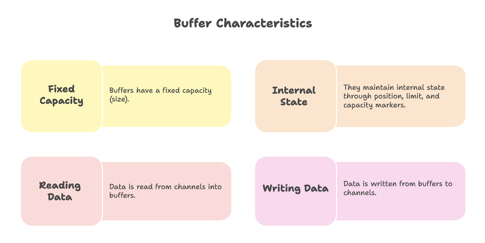
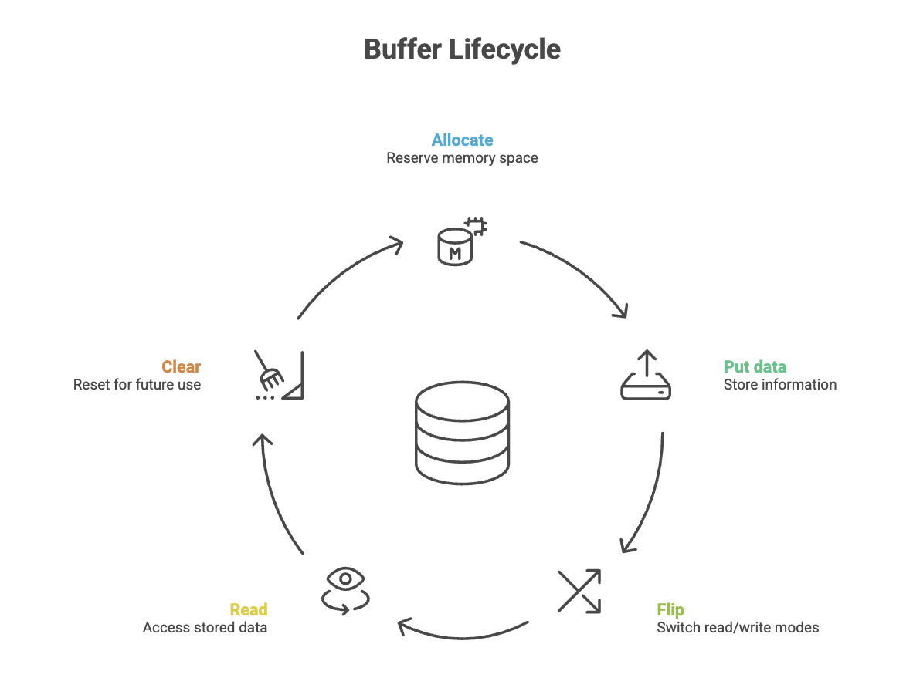
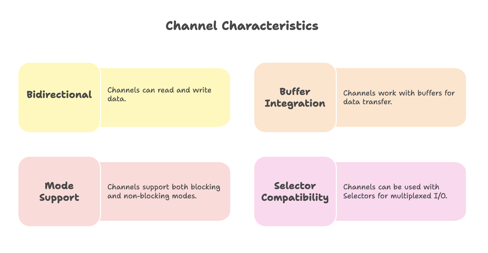
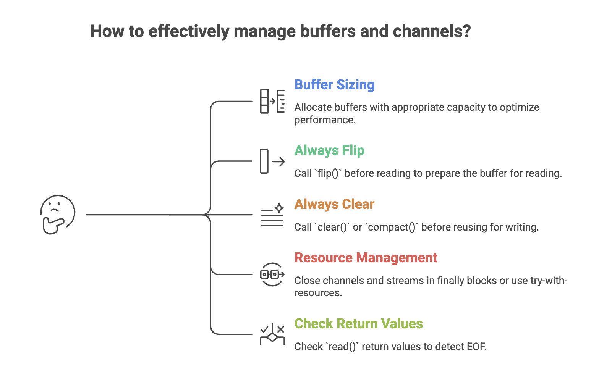

# Java NIO: Buffers and Channels

## Introduction to NIO Architecture

Java NIO (New I/O) represents a fundamental shift from traditional blocking I/O operations provided by `java.io`. The NIO package introduces a buffer-and-channel architecture that enables non-blocking I/O operations, multi-threading capabilities, and significantly improved performance for both file and network operations.


### The Problem with Traditional java.io

Traditional Java I/O operates in a blocking manner:
- When a thread reads from a stream, it blocks until data is available
- When a thread writes to a stream, it blocks until the write completes
- Each connection typically requires a dedicated thread
- Threads spend significant time waiting (idle) for I/O operations to complete

### The NIO Solution

Java NIO solves these problems by introducing:
1. **Buffers**: Containers for data being transferred
2. **Channels**: Connections to entities that perform I/O operations
3. **Non-blocking operations**: Threads can perform other tasks while waiting for I/O
4. **Multi-threading support**: Read and write operations can execute in separate threads


---


## Buffers

A buffer is a container object that holds data temporarily during I/O operations. Think of it as a fixed-size data structure that acts as a staging area for data transfer between your application and I/O channels.



### Buffer Types

Java NIO provides specialized buffer classes for different data types:
- `ByteBuffer` (most commonly used)
- `CharBuffer`
- `IntBuffer`
- `FloatBuffer`
- `DoubleBuffer`
- `LongBuffer`
- `ShortBuffer`


---


### Buffer Operations



### Creating a Buffer

```java
import java.nio.ByteBuffer;

// Allocate a buffer with capacity of 1024 bytes
ByteBuffer buffer = ByteBuffer.allocate(1024);
```

### Buffer States and Methods

**Position**: Current location in the buffer where next read/write will occur

**Limit**: First element that should not be read or written

**Capacity**: Maximum number of elements the buffer can hold

**Important Methods:**

1. **`put()`**: Writes data into the buffer
```java
String data = "Hello World";
buffer.put(data.getBytes());
```

2. **`flip()`**: Prepares buffer for reading after writing
```java
buffer.flip();  // Resets position to 0, sets limit to current position
```
The `flip()` method is crucial—it transitions the buffer from write mode to read mode by resetting the position to zero and setting the limit to the current position.

3. **`clear()`**: Prepares buffer for new write operations
```java
buffer.clear();  // Resets position to 0, limit to capacity
```

4. **`rewind()`**: Resets position to 0 for re-reading
```java
buffer.rewind();
```


---


## Channels

A channel represents a connection to an entity capable of performing I/O operations, such as:
- Files
- Network sockets
- Hardware devices



### Channel Types

1. **FileChannel**: File I/O operations
2. **SocketChannel**: TCP network connections
3. **ServerSocketChannel**: Listening for TCP connections
4. **DatagramChannel**: UDP network operations

### The Generic Nature of Channels

The `FileChannel` class and other channel implementations are designed generically, meaning they handle both file operations and network socket communication. This makes NIO applicable across various I/O operation types, not just file handling.


---


## Working with Buffers and Channels

### Reading from a File

```
Source → Channel → Buffer → Application
```

```java
import java.io.FileInputStream;
import java.nio.ByteBuffer;
import java.nio.channels.FileChannel;

public class NIOReadExample {
    public static void main(String[] args) {
        try {
            // 1. Create FileInputStream
            FileInputStream fileInputStream = new FileInputStream("input.txt");

            // 2. Get FileChannel from stream
            FileChannel fileChannel = fileInputStream.getChannel();

            // 3. Allocate buffer
            ByteBuffer buffer = ByteBuffer.allocate(1024);

            // 4. Read data from channel into buffer
            int bytesRead = fileChannel.read(buffer);

            while (bytesRead != -1) {
                // 5. Flip buffer to prepare for reading
                buffer.flip();

                // 6. Read data from buffer
                while (buffer.hasRemaining()) {
                    System.out.print((char) buffer.get());
                }

                // 7. Clear buffer for next read
                buffer.clear();

                // 8. Read next chunk
                bytesRead = fileChannel.read(buffer);
            }

            // 9. Close resources
            fileChannel.close();
            fileInputStream.close();

        } catch (Exception e) {
            e.printStackTrace();
        }
    }
}
```

**Step-by-step Explanation:**

1. Create a `FileInputStream` for the source file
2. Obtain the `FileChannel` from the stream
3. Allocate a `ByteBuffer` with appropriate capacity
4. Read data from the channel into the buffer (returns number of bytes read, or -1 when EOF)
5. Call `flip()` to switch buffer from write mode to read mode
6. Process the data in the buffer
7. Call `clear()` to prepare buffer for the next read cycle
8. Continue reading until end of file (bytesRead == -1)
9. Close channel and stream resources


### Writing to a File

```
Application → Buffer → Channel → Destination
```

```java
import java.io.FileOutputStream;
import java.nio.ByteBuffer;
import java.nio.channels.FileChannel;

public class NIOWriteExample {
    public static void main(String[] args) {
        try {
            // 1. Create FileOutputStream
            FileOutputStream fileOutputStream = new FileOutputStream("output.txt");

            // 2. Get FileChannel from stream
            FileChannel fileChannel = fileOutputStream.getChannel();

            // 3. Prepare data to write
            String data = "Hello, Java NIO!";

            // 4. Allocate buffer with data size
            ByteBuffer buffer = ByteBuffer.allocate(1024);

            // 5. Put data into buffer
            buffer.put(data.getBytes());

            // 6. Flip buffer to prepare for writing to channel
            buffer.flip();

            // 7. Write buffer contents to channel
            fileChannel.write(buffer);

            // 8. Close resources
            fileChannel.close();
            fileOutputStream.close();

            System.out.println("Data written successfully to output.txt");

        } catch (Exception e) {
            e.printStackTrace();
        }
    }
}
```

**Step-by-step Explanation:**

1. Create a `FileOutputStream` for the destination file
2. Obtain the `FileChannel` from the stream
3. Prepare the data you want to write
4. Allocate a `ByteBuffer` with sufficient capacity
5. Use `put()` to write data into the buffer
6. Call `flip()` to prepare the buffer for reading (channel will read from buffer)
7. Write the buffer contents to the channel
8. Close channel and stream resources


### Key Notes:
- Data always flows **from channels into buffers** for reading
- Data always flows **from buffers to channels** for writing
- The `flip()` method transitions the buffer between these modes


---


## Performance Benefits

### 1. Multi-threading Support

NIO enables multi-threaded I/O operations:
- Read operations can execute in one thread
- Write operations can execute in another thread
- Both file and network operations benefit from this parallelism

### 2. Non-blocking Operations

Unlike traditional I/O:
- Threads don't block waiting for data
- Can perform other tasks while I/O operations are in progress
- Significantly improves resource utilization and application responsiveness

### 3. Improved Throughput

Buffer-based operations reduce system calls and optimize data transfer:
- Bulk data operations instead of byte-by-byte transfers
- Direct memory access capabilities
- Better CPU and memory cache utilization


---


## Generic Communication Pattern

The buffer-and-channel architecture is not limited to file operations. It provides a generic framework for any communication involving reading and writing:

- **File I/O**: Reading and writing files
- **Network I/O**: Socket communication (TCP/UDP)
- **Inter-process communication**: Data exchange between processes
- **Device I/O**: Communication with hardware devices

This generic design allows you to use the same programming model and techniques across different I/O types, providing consistency and code reusability.





---


## Summary

* Java NIO uses a buffer-and-channel architecture where buffers temporarily store data and channels act as the connection for I/O operations.
* Data flows in a structured pattern—reading moves data from a channel to a buffer, while writing moves data from a buffer to a channel.
* Proper buffer state management using position, limit, capacity, and especially flip() is essential for correct operation.
* The same architecture works across files, network sockets, and other I/O types, making NIO a generic and reusable framework.
* Non-blocking support and multi-threading capabilities enable high-performance, scalable applications.


