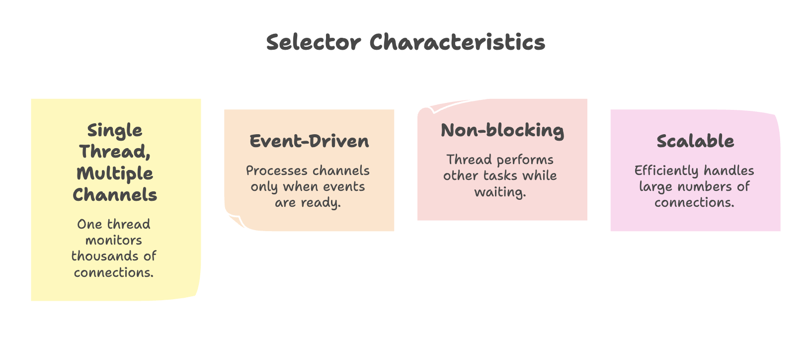
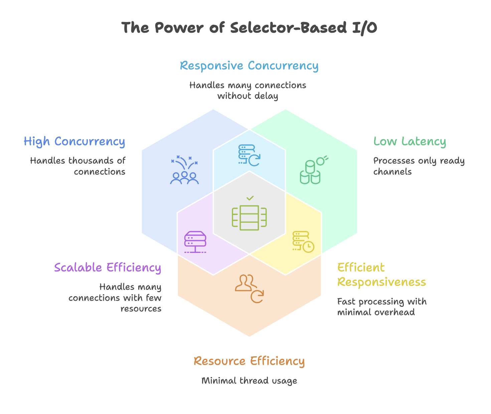

# Java NIO: Selectors and Non-blocking I/O


Java NIO Selectors represent the pinnacle of the NIO package's capabilities, enabling true non-blocking, scalable I/O operations. A Selector allows a single thread to efficiently monitor and manage multiple channels simultaneously, dramatically improving application performance and scalability compared to traditional one-thread-per-connection models.


## The Problem: Traditional Server Architecture

### One-Thread-Per-Connection Model

In traditional Java I/O, each client connection requires a dedicated thread:

```
Client 1 → Thread 1 (blocking on read/write)
Client 2 → Thread 2 (blocking on read/write)
Client 3 → Thread 3 (blocking on read/write)
...
Client 1000 → Thread 1000 (blocking on read/write)
```

**Problems with this approach:**

1. **Thread Overhead**: Each thread consumes system resources (memory, CPU for context switching)
2. **Wasted Resources**: Threads spend most time idle, waiting for I/O operations
3. **Poor Scalability**: Cannot handle thousands of concurrent connections efficiently
4. **Blocking Behavior**: Thread blocks during read/write operations, unable to do other work

### Example Scenario

When a thread reads data from a client:
- Thread calls `read()` and blocks
- Waits for data to arrive over the network (could be milliseconds to seconds)
- Thread remains idle during this entire waiting period
- Cannot handle other connections or perform other tasks
- Wastes CPU cycles and memory


---


## The Solution: Selectors and Non-blocking I/O

### What is a Selector?

A Selector is a multiplexer that can monitor multiple channels for events (like incoming data, connection acceptance, write readiness) and notify your application when events are ready for processing.

 

### How Selectors Work

```
                    ┌─────────────┐
                    │  Selector   │
                    └──────┬──────┘
                           │
            ┌──────────────┼──────────────┐
            │              │              │
       ┌────▼────┐    ┌────▼────┐   ┌────▼────┐
       │Channel 1│    │Channel 2│   │Channel 3│
       └─────────┘    └─────────┘   └─────────┘
            │              │              │
       ┌────▼────┐    ┌────▼────┐   ┌────▼────┐
       │Client 1 │    │Client 2 │   │Client 3 │
       └─────────┘    └─────────┘   └─────────┘
```

The Selector continuously polls the operating system to check which channels have events ready:
- Every few seconds (configurable), it checks all registered channels
- Returns immediately if no events are ready (returns 0)
- Returns the number of ready channels when events are available
- Application processes only the channels with ready events


---


## Core Components

### 1. Selector

Created using the `Selector.open()` method:

```java
import java.nio.channels.Selector;

Selector selector = Selector.open();
```

### 2. SelectableChannel

Channels that can be registered with a Selector:
- `ServerSocketChannel`: Listening for incoming connections
- `SocketChannel`: TCP network connections
- `DatagramChannel`: UDP connections

These channels must be configured in non-blocking mode:

```java
channel.configureBlocking(false);
```

### 3. SelectionKey

When a channel is registered with a Selector, it returns a `SelectionKey` object that represents the registration.

**Interest Operations (Events to Monitor):**

- `SelectionKey.OP_ACCEPT`: Ready to accept a new connection (ServerSocketChannel)
- `SelectionKey.OP_CONNECT`: Connection established (SocketChannel)
- `SelectionKey.OP_READ`: Ready to read data
- `SelectionKey.OP_WRITE`: Ready to write data

```java
SelectionKey key = channel.register(selector, SelectionKey.OP_READ);
```

You can register for multiple events:

```java
int interestSet = SelectionKey.OP_READ | SelectionKey.OP_WRITE;
channel.register(selector, interestSet);
```

### 4. Selection Process

The selector provides methods to check for ready channels:

```java
// Blocks until at least one channel is ready
int readyChannels = selector.select();

// Blocks for a maximum timeout period
int readyChannels = selector.select(2000); // 2 seconds

// Returns immediately (non-blocking)
int readyChannels = selector.selectNow();
```

Return value:
- `0`: No channels ready
- `> 0`: Number of channels with ready events


---


## Building a High-Performance NIO Server

### Architecture Overview

A scalable NIO server combines three approaches:

1. **Selector Thread**: One thread monitors all connections using a Selector
2. **Accept Separation**: Connection acceptance is handled efficiently
3. **Worker Threads**: Multiple threads process actual client requests

This separation ensures:
- Connection acceptance is never blocked
- Request processing doesn't slow down new connections
- System resources are utilized efficiently

### Complete Server Implementation

```java
import java.io.IOException;
import java.net.InetSocketAddress;
import java.nio.ByteBuffer;
import java.nio.channels.SelectionKey;
import java.nio.channels.Selector;
import java.nio.channels.ServerSocketChannel;
import java.nio.channels.SocketChannel;
import java.util.Iterator;
import java.util.Set;

public class NIOServer {

    public static void main(String[] args) throws IOException {
        // 1. Create Selector
        Selector selector = Selector.open();

        // 2. Create ServerSocketChannel
        ServerSocketChannel serverSocket = ServerSocketChannel.open();
        serverSocket.bind(new InetSocketAddress("localhost", 8080));

        // 3. Configure non-blocking mode
        serverSocket.configureBlocking(false);

        // 4. Register channel with selector for ACCEPT events
        serverSocket.register(selector, SelectionKey.OP_ACCEPT);

        System.out.println("Server started on port 8080");

        // 5. Main event loop
        while (true) {
            // Wait for events (polls OS every ~2 seconds)
            int readyChannels = selector.select();

            if (readyChannels == 0) {
                continue; // No events ready
            }

            // 6. Get set of keys with events
            Set<SelectionKey> selectedKeys = selector.selectedKeys();
            Iterator<SelectionKey> keyIterator = selectedKeys.iterator();

            // 7. Process each key
            while (keyIterator.hasNext()) {
                SelectionKey key = keyIterator.next();

                // 8. Handle different event types
                if (key.isAcceptable()) {
                    handleAccept(serverSocket, selector);
                }

                if (key.isReadable()) {
                    handleRead(key);
                }

                // 9. CRITICAL: Remove processed key
                keyIterator.remove();
            }
        }
    }

    private static void handleAccept(ServerSocketChannel serverSocket,
                                     Selector selector) throws IOException {
        // Accept new connection
        SocketChannel client = serverSocket.accept();

        if (client != null) {
            // Configure non-blocking mode
            client.configureBlocking(false);

            // Register for READ events
            client.register(selector, SelectionKey.OP_READ);

            System.out.println("New client connected: " + client.getRemoteAddress());
        }
    }

    private static void handleRead(SelectionKey key) throws IOException {
        SocketChannel client = (SocketChannel) key.channel();

        // Allocate buffer
        ByteBuffer buffer = ByteBuffer.allocate(1024);

        try {
            // Read data from client
            int bytesRead = client.read(buffer);

            if (bytesRead == -1) {
                // Client closed connection
                System.out.println("Client disconnected");
                client.close();
                return;
            }

            // Prepare buffer for reading
            buffer.flip();

            // Convert to string
            byte[] data = new byte[buffer.remaining()];
            buffer.get(data);
            String message = new String(data);

            System.out.println("Received: " + message);

            // Echo response back to client
            String response = "Echo: " + message;
            ByteBuffer responseBuffer = ByteBuffer.wrap(response.getBytes());
            client.write(responseBuffer);

            // Close connection after response
            client.close();

        } catch (IOException e) {
            System.out.println("Error reading from client");
            client.close();
        }
    }
}
```

### Step-by-Step Explanation

**Initialization Phase:**

1. **Create Selector**: `Selector.open()` creates the multiplexer
2. **Create ServerSocketChannel**: Opens the server socket for listening
3. **Bind to Port**: Associates the server with a specific port (8080)
4. **Configure Non-blocking**: Essential for use with Selector
5. **Register for ACCEPT**: Tell Selector to notify when new connections arrive

**Event Loop Phase:**

6. **Select Events**: `selector.select()` blocks until events are ready
   - Polls OS every ~2 seconds checking for events
   - Returns 0 if nothing ready, or number of ready channels
7. **Get Selected Keys**: Retrieve set of keys with ready events
8. **Iterate Keys**: Process each key individually
9. **Check Event Type**: Use `isAcceptable()`, `isReadable()`, etc.
10. **Handle Events**: Call appropriate handler methods
11. **Remove Key**: **CRITICAL** - Remove processed key from iterator


### Why Removing Keys is Critical? 

The `selectedKeys()` set is **not automatically cleared**. If you don't remove processed keys:
- Same key appears in next iteration
- Events get processed multiple times
- Can cause infinite loops or duplicate processing

```java
keyIterator.remove(); // Must do this after processing each key
```

### Handling Different Events

**Accept Event (New Connection):**

```java
private static void handleAccept(ServerSocketChannel serverSocket,
                                 Selector selector) throws IOException {
    SocketChannel client = serverSocket.accept();
    client.configureBlocking(false);
    client.register(selector, SelectionKey.OP_READ);
}
```

1. Accept the new connection
2. Configure it as non-blocking
3. Register it with the Selector for READ events
4. Now the Selector monitors this client for incoming data


### Read Event (Data Available):

```java
private static void handleRead(SelectionKey key) throws IOException {
    SocketChannel client = (SocketChannel) key.channel();
    ByteBuffer buffer = ByteBuffer.allocate(1024);

    int bytesRead = client.read(buffer);

    if (bytesRead == -1) {
        client.close(); // Client disconnected
        return;
    }

    buffer.flip();
    // Process data...
}
```

1. Get the channel from the key
2. Create buffer to hold data
3. Read data into buffer
4. Check for connection closure (bytesRead == -1)
5. Process the data
6. Optionally write response back


---


## Performance Benefits

### Scalability Comparison

| Aspect             | Traditional Model                                | NIO Selector Model                                               |
| ------------------ | ------------------------------------------------ | ---------------------------------------------------------------- |
| Thread Usage       | 1000 clients = 1000 threads                      | 1000 clients = 1 selector thread + few worker threads (e.g., 10) |
| Memory Consumption | High memory usage (each thread ~1MB stack space) | Minimal memory overhead                                          |
| CPU Utilization    | Heavy context switching causes CPU thrashing     | Reduced context switching, better CPU efficiency                 |
| I/O Handling       | Most threads remain idle waiting for I/O         | Single thread monitors events, processes only ready channels     |
| Scalability        | Poor scalability for large connections           | Highly scalable for thousands of concurrent connections          |





---


## Summary

* Java NIO Selectors allow a single thread to monitor and manage multiple channels simultaneously, enabling efficient I/O multiplexing.
  
* They follow an event-driven model, processing only those channels that are ready for operations like accept, read, or write.
  
* Channels must be configured in non-blocking mode, and processed selection keys must be removed to avoid duplicate handling.
  
* Selectors significantly improve scalability by handling thousands of connections with minimal threads and reduced resource usage.
  
*  When combined with buffers and channels, Selectors form the foundation for building high-performance, scalable network servers.
